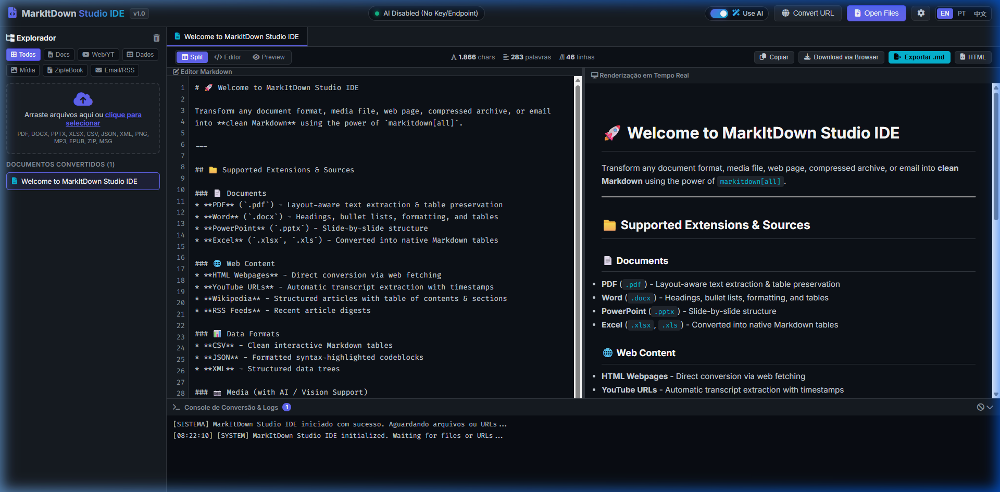

<div align="center">

# 🚀 MarkItDown Studio IDE (Português)

**O Studio Universal de Transformação de Documentos para Markdown Potencializado por IA**

[](https://github.com/gugaucb/markdown-studio-ide/actions)
[](https://hub.docker.com/r/gugaucb/markdown-studio-ide)
[](https://github.com/gugaucb/markdown-studio-ide/releases)
[](https://opensource.org/licenses/MIT)
[](ui/locales/)

[English](README.md) • [Português do Brasil](README.pt-BR.md) • [简体中文](README.zh-CN.md)

<br/>



</div>

---

## 🌟 Visão Geral

O **MarkItDown Studio IDE** é um ambiente moderno e de alta performance projetado para converter qualquer tipo de documento, mídia, arquivo compactado ou página web em **Markdown limpo e estruturado**.

Construído sobre a biblioteca `markitdown` da Microsoft e o `pymupdf4llm`, ele oferece um editor com visão dividida em tempo real (editor de código + preview HTML renderizado), pipeline de reparo automático de caracteres/mojibake, salvaguarda estrita para preservação de tabelas e suporte nativo a modelos de IA locais (Ollama / LM Studio) e em nuvem (OpenAI / Groq / OpenRouter).

---

## ✨ Principais Recursos

- 📑 **Amplo Suporte a Formatos**: PDF, Word, PowerPoint, Excel, CSV, JSON, XML, Áudio, Imagens, EPUB, ZIP e e-mails `.msg` do Outlook.
- 🌐 **Conversão de Web e Mídias**: Extração direta a partir de links HTML, vídeos do YouTube (transcrição com timestamps), artigos da Wikipedia e feeds RSS.
- 🧠 **Correção de Encode e Mojibake**: Prompt otimizado para detectar e corrigir anomalias de caracteres corrompidos (`ção` -> `ação`), palavras partidas por hifenização e concordância ortográfica.
- 📊 **Preservação Rigorosa de Tabelas**: Converte e mantém intactas tabelas Markdown sem transformá-las em texto corrido ou resumos.
- 🌍 **Internacionalização Completa (i18n)**: Suporte nativo a **Inglês (padrão)**, **Português do Brasil** e **Chinês Simplificado**, selecionáveis na barra superior e salvos no navegador.
- 💻 **IDE com Visão Dividida**: Editor com numeração de linhas, métricas em tempo real (caracteres, palavras, linhas e selo de IA) e console interativo de logs.
- 🐳 **Pronto para Docker e DockerHub**: Implantação com comando único e ponte automática para o Ollama que roda no sistema host.
- 🧪 **Testes Automatizados (TDD)**: Suíte completa com `pytest` e fluxos de integração contínua (CI) no GitHub Actions.

---

## 🚀 Como Iniciar

### 1. Executando com Docker (Recomendado)

```bash
git clone git@github.com:gugaucb/markdown-studio-ide.git
cd markdown-studio-ide

docker compose up -d
```

Acesse a interface no navegador em **[http://localhost:8000](http://localhost:8000)**.

---

### 2. Executando Localmente com Python

```bash
git clone git@github.com:gugaucb/markdown-studio-ide.git
cd markdown-studio-ide

# Criar e ativar o ambiente virtual
python -m venv venv
.\venv\Scripts\activate   # No Windows
# source venv/bin/activate # No Linux/macOS

# Instalar dependências
pip install -r requirements.txt

# Iniciar o servidor
python app.py
```

---

## 📄 Licença

Distribuído sob a licença **MIT** - consulte o arquivo [LICENSE](LICENSE) para mais detalhes.
